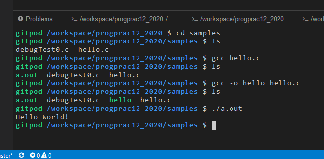
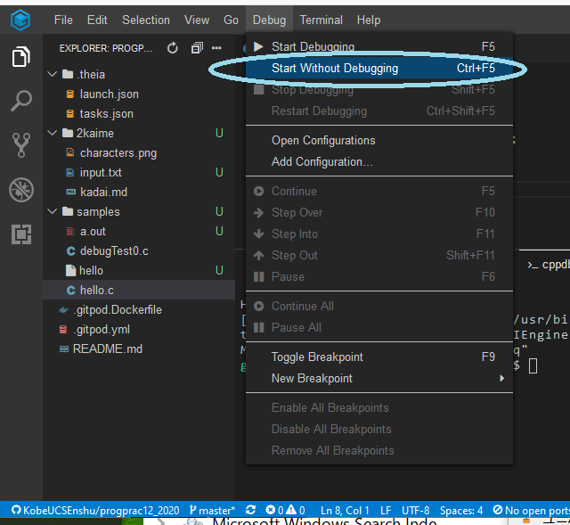

# コンパイル＆実行 (Gitpod)

ターミナルから、Unix コマンドを実行する方法と、GUI操作をおこなう場合を紹介します。

## Terminal 操作

もし、ターミナルがない場合は、先にメニューの `Terminal` から `New Terminal` でターミナルを開きましょう。

`gcc` というコンパイラが使えます。

以下は、`samples/hello.c` をコンパイルする例 (`注`: コンパイルする前に、ファイルを保存するのを忘れないように！）


```
gitpod /workspace/progprac12 $ cd samples (directory を変える change directory command)
gitpod /workspace/progprac12/samples $ ls  (現在の directory の内容を表示する list command)
debugTest0.c  hello.c
gitpod /workspace/progprac12/samples $ gcc hello.c  (hello.c をコンパイル)
gitpod /workspace/progprac12/samples $ ls (a.out という名前で実行ファイルが生成)
a.out  debugTest0.c  hello.c
gitpod /workspace/progprac12_2020/samples $ ./a.out (実行してみる)
Hello World!
```

各コマンドのオプションや、コマンドライン引数の与え方は、[こちら](https://sites.google.com/view/proenshu1kobeu/%E3%83%9B%E3%83%BC%E3%83%A0/%E7%AC%AC%E5%9B%9E_1/%E5%9F%BA%E6%9C%AC%E3%81%AEunix%E3%82%B3%E3%83%9E%E3%83%B3%E3%83%89)や[こちら](https://sites.google.com/view/proenshu1kobeu/%E3%83%9B%E3%83%BC%E3%83%A0/%E7%AC%AC%E5%9B%9E_4/c%E8%A8%80%E8%AA%9E%E3%82%BD%E3%83%BC%E3%82%B9%E3%83%97%E3%83%AD%E3%82%B0%E3%83%A9%E3%83%A0%E3%81%AE%E5%AE%9F%E8%A1%8C%E6%B5%81%E3%82%8C)を参考にしてください。
他にももっと知りたい人は検索してみてください。



## GUI 操作

1. `samples/hello.c` を開いてください。`samples` の中が見えない場合は、クリックで directory の中のファイルも見えるはず。
2.  `注`: ファイルを保存してない場合は、コンパイル前に保存しましょう！
3. コンパイル：実行対象プログラムを Editor 上で選択した状態(`hello.c`選択）で、"Terminal"->"Run Build Task.." でコンパイル可能。選択肢が出ますので、`build gcc`をえらびましょう。同じ directory に `hello` ができれば成功
   * `注1`: 違うファイルを選択していると、コンパイルできません。
   * `注2`: explorer 側で選択するだけでなく、エディタのフォーカスがあっている必要があるようです。
4. 実行：`Debug`->`Start Without Debugging` で実行開始。
   * `Start With Debugging` だとデバッガ Sidebar が出てきて、そこで実行します。開始ボタン（緑△）で実行するかと。
   * 環境によっては ショートカット(debug: `F5`, 通常実行: `Ctl` + `F5`)が割り当てられています。



