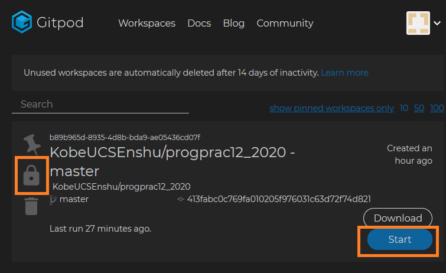
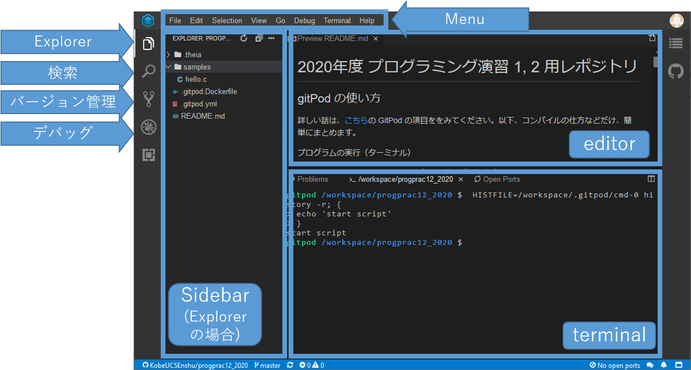
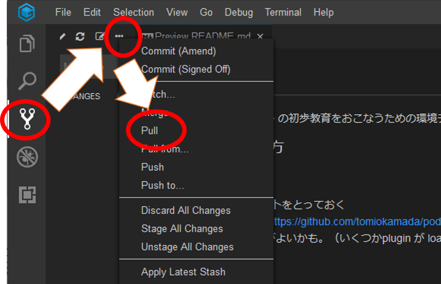

# 簡単な利用法 (Gitpod)

## workspace 作成

最初は github 上のレポジトリから皆さん用の Workspace を作成します。

* レポジトリの例：[2020年プログラミング演習用レポジトリ](https://github.com/KobeUCSEnshu/progprac12_2020)
* 上ページの画面右上の`Gitpod` ボタンをクリックするか、[こちら](https://gitpod.io/#https://github.com/KobeUCSEnshu/progprac12_2020)をクリックしてください。
* セットアップには、少し時間がかかります。

上記が、`workspaceを作成する操作で初回だけで十分`です。しばらく同じ workspace を使いましょう。自分の作ったプログラムなども Workspace 上に作成されます。
別に、画面を閉じても workspace は消えません。
後に述べる workspace 一覧表示から再開可能です。

`注`: Gitpod の無料ライセンスでは、`workspace は２週間アクセスしないと消滅します`。
自分の作成した課題プログラムなどは、ダウンロードするなどして保存（後述）しておきましょう。
git 使いは、自分の private repository に保存するなりお好きにどうぞ。

## workspace 一覧・起動

自分の workspace 一覧は、[Gitpod](https://gitpod.io/)にログインすれば、すぐ表示可能です。

`Open` もしくは `Start` ボタンで再開可能です。

`鍵` マークを外すと、他の人に自分の workspace を見せることができます。
gitpod 起動中の当該ページの URL を取得すれば OK です。
一方で、その URL をネットに晒すと、皆さんのアカウントと紐づけられた workspace 上で、いろんな悪いことがおこるかもしれませんので、注意しましょう。

## 開発画面

まず、画面右側について。

* Editor: ファイルの中身を表示したり編集したりする場所
* ターミナル: 下側にはいろんなタブを選択できますが、今は`Terminal`が表示されています。こちらから、いろんな命令を実行できます。

次に画面左側ですが、左側のボタンで Sidebar の表示画面を切り替えできます。

* エクスプローラー: ファイルを選択するための画面
* 検索： 文字列を検索するための画面
* ソース管理：バージョン管理, レポジトリアクセス
* デバッグ：デバッガを用いてプログラムの実行状態を確認するための画面
* Extensions: 拡張機能用ですが、知らなくてもOKです。

## レポジトリ最新データの取得

レポジトリから最新情報を取得するには、以下の手順で `git pull` をおこないます。

1. `Source control` 用の Sidebar を表示し、
2. `...` をクリックして `Pull` を選択します。更新データがあればメッセージが表示されます。
3. `Explorer Sidebar` を表示すれば、新しいファイルなどが見えるようになっているはず。

## 授業時のサイクル

1. [Gitpod](https://gitpod.io/)にアクセスし、workspace を開く
2. 新しい課題が出ている場合は、`git pull`でレポジトリ最新データの取得
3. 課題を解く
   * プログラムを記述
   * コンパイル＆実行
   * デバッグ
4. 課題提出
   * Gitpod からのファイルのダウンロード：`Explorer Sidebar` を開いて、ファイルを選択して右クリック、`Download` を選択すれば大丈夫。
   * Gitpod へのアップロード：こちらは、ファイルの drag&drop で大丈夫。

## コンパイル＆実行

準備中

## デバッグ

デバッグの方法については、[VSC版の説明](../vsc/Cdebug.md)を見てください。

## FAQ

* Q: 画面、へんなことなっちゃった。もどしてくれー
  * 画面左側のパネル(Sidebar) は、一番左端のボタンで表示切替できるよ。
  * 右側も含めて変なことなったら、以下の操作で初期状態に戻るよ。
    * `View` → `Find Command` → `> ` フィールドに `reset` と入力 → `Reset workbench layout` という選択肢が現れるので、それを選択。 
    * 今後は、消さずにタブを切り替えたりしながら使おう！

