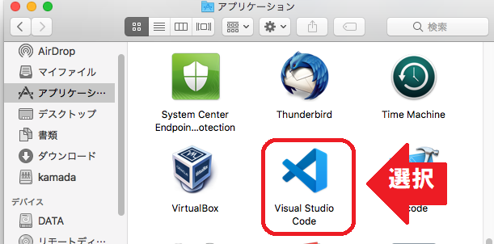
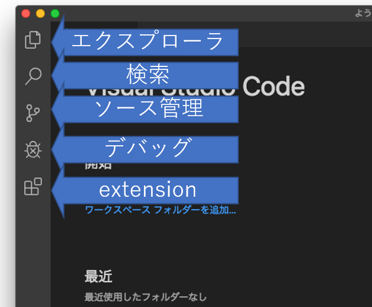
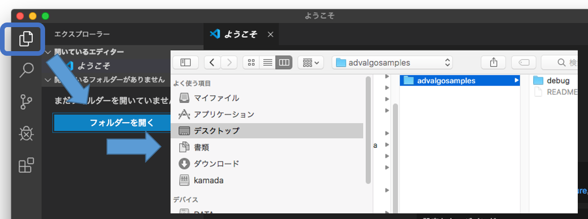
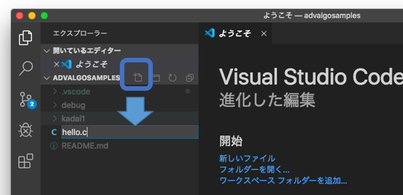
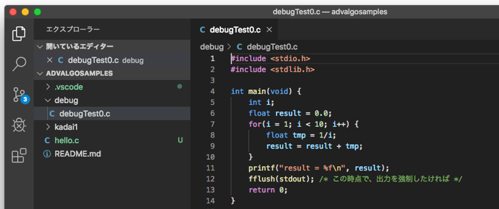
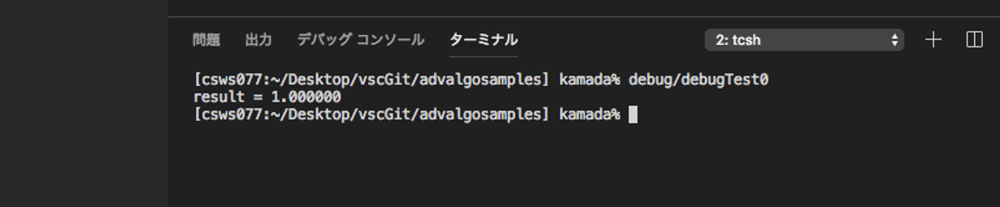

# VS Code, C環境の使い方

## 起動の前に

先に事前準備しましょう([演習室用](eroom.md), [自宅環境](Csetup.md))。

終わったら、VS code を起動しましょう。
演習室では、Finder をあげて`アプリケーション`の中にある `Visual Studio Code` をダブルクリックすればOKです。

## 起動

以下が、普段つかう画面です。左側のアイコンの機能を把握しておいてください。

* エクスプローラー
* 検索
* ソース管理
* デバッグ
* Extension

クリックすると、各機能用の画面がOn/Offされます。

## フォルダを開く

プログラムを配置するフォルダの指定を要求されます。
自分でフォルダを選択して選んでください。

`advAlgoSetup.sh` を実行した人は、`Desktop` の下の `vscGit1 の更に下にある `advalgosamples` フォルダを選択すればOKです。

## プログラム作成

`advAlgoSamples` フォルダの場合、すでにサンプルプログラムを作成してあります。

新規プログラム作成時は、フォルダの`新しいファイル`ボタンを押して、hello.c とかファイル名を入力してください。
insider build 使うとか聞かれるかもしれませんが、拒否してもらってOKです。

drag & drop で配置してもらうのでも構いません。

## プログラムの実行

`注:` フォルダの `.vscode` 以下に、`launch.json` および `tasks.json` がない場合は、初回時に作成が必要です。あとに書く手続きをおこなってください。`advAlgoSamples`は設定済みです。

例えば、`hello.c` を実行したい場合は、`hello.c` を`選択した状態`で、「デバッグ」→「デバッグなしで実行」を選んでください。

デバッガにかける場合は、「デバッグの開始」になります。詳しくは、[こちら](vscCdebug.md)。

標準出力は、ターミナルもしくはデバッグコンソールにでます。

`注:` 上記 json ファイルができていない場合は、以下の警告が２回出るはずです。それぞれ、以下の対応をしてもらうか、[launch.json](eroom/launch.json), [tasks.json](eroom/tasks.json)をダウンロードして、`.vscode` directory に配置してください。

1. `環境の選択`という欄があらわれます。`C++ (GDB/LLDB)` → `gcc build and budeg active file` を選んでください。
2. 再度、`対象プログラムを選んだ状態にしてから`実行を試みると、今度は、`タスク...を見つけられませんでした`などと出るかと。`タスクの構成`を選んで、`C/C++:gcc build active file`を選んでください。

* `launch.json` や `tasks.json` は、VS code が 実行環境に応じて作成したものを使えばいいと思いますが、`advAlgoSetup.sh` でセットアップしたものは、Mac: gcc + gdb 環境用の設定にしてあります。

### プログラムへの引数の与え方

`launch.json` をイジったり、`Runner`を設定する方法もありますが、いろいろ面倒なのでターミナルから実行する方法を教えます。

「ターミナル」→「新しいターミナル」で、vscode 内にターミナルが開くので、そこでコマンドを実行するのが早いでしょう。

## ファイルの設置

プログラムは、対象の「フォルダ」直下で実行されます。

なので、アクセスファイルは、「フォルダ直下」に置くか、ファイル名を指定する際、対象ファイルへの正しい（相対／絶対）パスを記述しましょう。

## FAQ, トラブルシューティング

* Q: Dock に Visual Studio Code がない
  * Ans: 「Finder」の左部の「アプリケーション」の中を探してください。登録したければ、Dock 上で右クリックした際にあらわれるオプションメニューで選べます。

